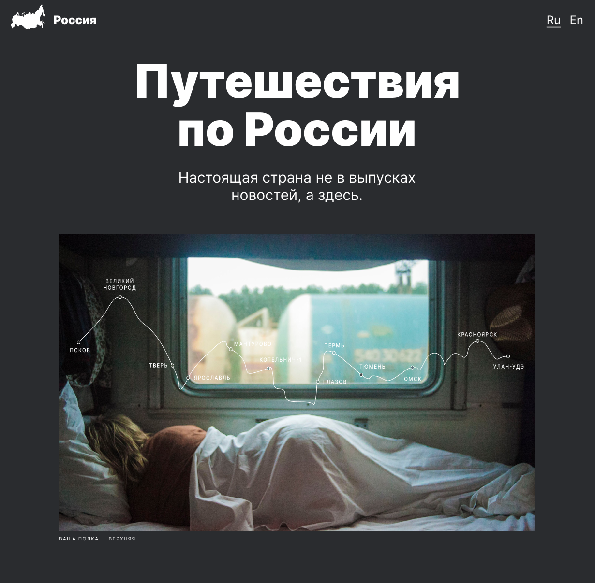

<h1 align="center">russian-travel</h1>

---

Этот проект был выполнен с целью отработки новых теоретических знание на тему адаптивной верстки.
Для работы был взят макет, который служит целью донести до клиента интересные факты и достопримечательности, которые можно увидеть в путешествии по самой большой стране.

# Цели, которых я добился в проекте
* Верстка, должна быть полностью резиновой.
* Изображения должны быть адаптированы под каждую ширину монитора.
* Научиться принять функции calc, minmax, auto-fit...
* Познакомиться в работе с гридами.
* Верстка должна максимально совпадать с макетом, различия в несколько px критичны.
* Исследовать дополнительные материалы, не останавливаться на том, что умею, а приносить новые подходы (aspect-ratio:)

<h2>Работа выполнена с использованием технологий:</h2>
<ul>
  <li>
HTML
</li>
  <li>
CSS
</li>
  <li>
JavaScript
</li>
  <li>
Flexbox Layout
</li>
  <li>
Grid Layout
</li>
  <li>
Проект сделан по принципам объектно-ориентированного программирования
</li>
</ul>

________________________________

# Cсылка gh - https://ilkor4.github.io/russian-travel/

<h2>Над проектом работал:</h2>
<h3><a href="https://github.com/ilkor4" target="_blank">Il.kor</a></h3>

